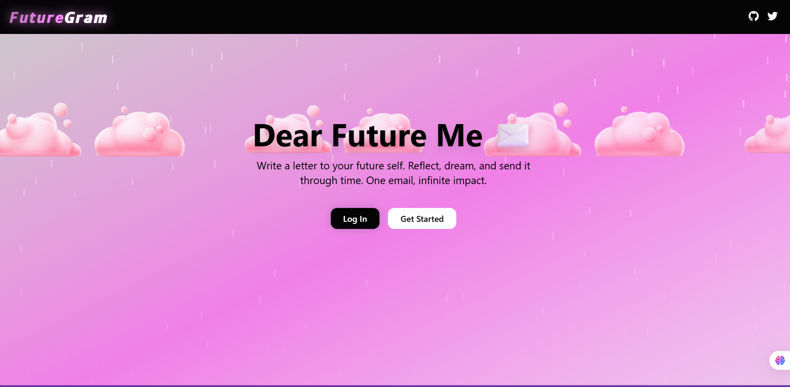

# Project Title

A brief description of what this project does and who it's for

Absolutely, Prarthana! Here's a clean and professional brief about **FutureGram**, along with a clear explanation of its directory structure.

---

## 🌟 Project Name: **FutureGram**

**FutureGram** is a MERN-stack-based web application that allows users to write heartfelt letters to their *future selves*. It’s an emotionally thoughtful productivity app that helps users reflect on their goals, express gratitude, and stay motivated over time by scheduling messages that will be emailed to them later.

### ✨ Key Features:

* 📝 Write letters to your future self
* 📅 Schedule when the email should be delivered
* 💌 Store letters in a secure database
* 📬 Delivers scheduled emails using backend cron logic
* 🎨 Aesthetic UI with customizable themes (rosy, dark, white)
* 🔒 JWT-based secure authentication system
* 🌈 Animated backgrounds, glowing effects, and handwritten-style fonts for a premium emotional vibe

---

## 📁 Directory Structure (FutureGram)

```
FutureGram/
│
├── client/                       # Frontend (React)
│   ├── public/                  # Static assets
│   └── src/
│       ├── components/          # Reusable UI components (e.g., BackgroundMotion)
│       ├── pages/               # Main pages (Login, Register, LetterPage)
│       ├── App.js               # Route and layout setup
│       ├── main.jsx             # React root rendering
│       └── Api.js               # Axios setup for API requests
│
├── server/                       # Backend (Express)
│   ├── controllers/             # Logic for auth, letters
│   ├── routes/                  # API endpoints
│   ├── models/                  # Mongoose schemas (User, Letter)
│   ├── middlewares/            # Auth middleware (JWT)
│   ├── utils/                   # Utility functions (email scheduler, etc.)
│   ├── config/                  # MongoDB connection and env config
│   ├── server.js                # Main backend entry point
│
├── .env                          # Environment variables (secret keys, DB URI)
├── package.json                  # Project dependencies (root or split between client/server)
├── README.md                     # Project documentation
```

---

## 🧠 Technologies Used

* **Frontend**: React.js, Framer Motion, Lucide Icons
* **Backend**: Express.js, MongoDB, Mongoose
* **Styling**: Poppins & Caveat fonts, pure CSS, gradients
* **Authentication**: JWT
* **Email Sending**: Nodemailer (with scheduling logic)
* **API Testing**: Postman or ThunderClient

---
# 💌 FutureGram

Write a letter to your future self. Reflect, dream, and send it through time. One email, infinite impact.



